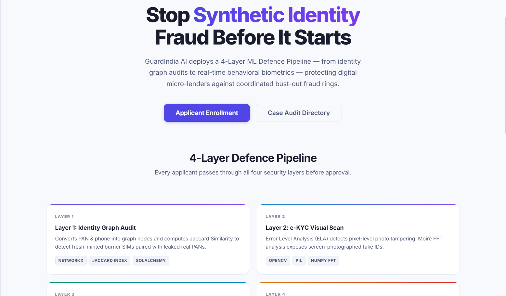

# GuardIndia AI

GuardIndia AI is an advanced, multi-layered real-time security and fraud prevention platform built specifically to protect digital micro-lenders and instant-credit platforms against automated, machine-scaled **Synthetic Identity Fraud**.



---

## 1. The Definitive Problem Statement

The rapid adoption of India’s population-scale Digital Public Infrastructure (DPI), led by the frictionless speed of the Unified Payments Interface (UPI) and automated e-KYC pipelines, has introduced an aggressive, machine-scaled financial vector known as **Synthetic Identity Fraud** within the digital micro-lending and instant-credit sectors. Modern fraud syndicates have evolved away from traditional identity theft toward industrialised "Synthetic Factories" powered by generative AI. They harvest leaked, valid identification metrics (such as genuine Aadhaar or PAN data strings) and seamlessly stitch them with fabricated names, pre-activated burner SIMs, and AI-generated biometric facades.

Because these hybrid profiles contain partial, valid government registry data, they bypass static onboarding verifications completely. Fraud networks meticulously incubate these ghost personas over several months using automated micro-repayments to cultivate pristine credit profiles (CIBIL > 700). Upon unlocking peak tier thresholds, they coordinate rapid, multi-platform "bust-out" loan withdrawals within a tight window—exploiting the data synchronization lags of central credit bureaus to siphon maximum capital through distributed mule accounts before vanishing without a trace.

---

## 2. Analysis of Existing Solutions & Market Bottlenecks

A comprehensive survey of current industrial security paradigms reveals major structural blind spots:

### Static Government Registry Matching (DPI/e-KYC Checkers)
* **What they do:** Services cross-reference input alphanumeric strings directly against central identity databases (NSDL/UIDAI).
* **The Bottleneck:** They only validate if the identifier *exists* and is active. They fail to assess the contextual linkage history between the data fields (e.g., whether this specific PAN has historically been bound to this newly minted phone number).

### Traditional Biometric Face-Matching & Gesture Liveness
* **What they do:** Workflows require a smartphone selfie paired with passive or basic active gestures (such as blinking, nodding, or smiling) to calculate facial symmetry matches.
* **The Bottleneck:** They are profoundly vulnerable to **Virtual Camera Injection Attacks** and real-time deepfakes (utilizing rooted device hooks or Android emulation). Because current setups only check for *procedural motion rules* (e.g., did an eye blink?), they fail to detect deepfake layers mirroring commands on the fly or edge anomalies indicating a re-photographed display.

### Ecosystem-Wide Shared Utilities (MuleHunter.ai / I4C Suspect Registry)
* **What they do:** Trace compromised accounts and illicit fund trajectories across banks.
* **The Bottleneck:** These systems are largely **reactive and transaction-centric**. They are designed to hunt down money mules *after* anomalous velocities occur. They are not positioned at the immediate client-side application layer to dynamically evaluate device telemetry or behavioral screen interactions before a loan is approved.

---

## 3. The 4-Layer Core Architecture Matrix

GuardIndia AI breaks this industrialised execution loop by deploying a specialized multi-layered defense pipeline.

```
[Layer 1: Identity Ingestion] ──► Cross-Registry Graph Linkage Audit
                                          │
[Layer 2: Live e-KYC]         ──► Error Level Analysis (ELA) & Photometric Scan
                                          │
[Layer 3: Incubation Loop]    ──► WebGL Hardware Fingerprinting & Isolation Forests
                                          │
[Layer 4: Coordinated Payout] ──► Random Forest / Trajectory Biometrics
```

### Layer 1: Identity Graph Audit
* **The Exploit:** Attackers pull clean, real tax identifiers (PAN) from dark web breaches and pair them with newly registered burner SIMs and artificial names to establish a "thin-file" footprint that registers a green light across standard e-KYC entry gates.
* **The Solution:** The backend converts incoming fields into linked mathematical nodes using an in-memory graph architecture (`NetworkX`). Rather than verifying text, it computes edge weights and **Jaccard Similarity Coefficients** against recent database entries. If a historic PAN node attempts to form an edge with an isolated network node that breaks its established registry footprint, the system triggers an immediate identity dissociation flag.

### Layer 2: e-KYC Visual Scan
* **The Exploit:** Fraudsters feed digitally manipulated document templates into camera streams using injection software, or they hold up high-resolution displays to pass selfie verification checks using sophisticated deepfake models.
* **The Solution:**
  * **Error Level Analysis (ELA):** The system resaves the uploaded document image matrix at a deterministic JPEG compression rate (95%) and isolates the absolute pixel deviation. Since digitally altered segments (like a swapped facial canvas or modified name string) compress unevenly compared to authentic templates, we flag these invisible editing boundaries instantly.
  * **Moiré Fourier Transformation Check:** To block screen-photo fraud, visual data is transformed into the frequency domain via a Fast Fourier Transform (`numpy.fft.fft2()`). Digital monitors generate periodic, high-frequency spikes across screen pixel arrays, allowing the engine to instantly distinguish between a physical ID card and a screen reproduction.
  * **Dynamic Photometric Liveness Verification:** During selfie capturing, our web client forces the browser display to emit a rapid, randomized color sequence (e.g., flashing neon blue, amber, pink). Our computer vision models analyze the raw skin reflection coordinates; an organic three-dimensional human face shifts its illumination vectors dynamically, whereas flat video injections or pre-recorded deepfakes maintain uniform lighting and are immediately rejected.

### Layer 3: Device Fingerprinting
* **The Exploit:** Organized syndicates cycle small micro-loans over 60 to 90 days to artificially manufacture an immaculate credit tier, tricking current linear credit risk formulas that treat timely repayments as an absolute indicator of a safe user.
* **The Solution:**
  * **Unalterable WebGL Hardware Fingerprinting:** Our web client forces the browser to execute a silent, complex 3D graphic asset render using WebGL. Because pixel-blending configurations and GPU clock tolerances vary across physical device chipsets, the resulting image byte string forms a highly distinct hardware signature. Even if a fraud ring swaps names across 50 dummy accounts, their underlying emulation cluster or hardware farm signature matches, exposing the batch operation.
  * **Temporal Anomaly Trackers (Isolation Forest):** We feed metadata variables—including `login_time_deltas`, `session_durations`, and `network_hop_counts`—into an unsupervised **Isolation Forest model**. The model flags hyper-tight operational intervals as anomalous clusters ($Score \to -1$).

### Layer 4: Behavioral Biometrics
* **The Exploit:** Once credit tiers maximize, attackers hit multiple lending apps simultaneously to empty limits before databases can sync, siphoning cash through distributed UPI channels.
* **The Solution:**
  * **Continuous Behavioral Telemetry (Random Forest):** During the loan disbursement checkout phase, our web client records mouse movements, click coordinates, keystroke dynamics, and touch events. Real human interaction displays natural mechanical imperfections and pixel offsets. In contrast, automated execution scripts interact with mechanical precision and absolute pixel targets. A **Random Forest Classifier** trained on organic human navigation maps flags robotic signatures instantly, freezing the payout.

---

## 4. Real-Time Telemetry & Model Alignment

To ensure a **1:1 mapping** between training datasets and our real-time application stack (Vite + React Frontend -> FastAPI Backend -> ML Models), we implement rigorous feature alignment:

### Layer 3 Feature Tracker
* **Features Used:** `DeviceID`, `IP_Address`, `TransactionDate`, `PreviousTransactionDate`, `LoginAttempts`
* **Model:** Isolation Forest
* **Data Capture:**
  * `DeviceID` is captured via the silent WebGL rendering script.
  * `IP_Address` is parsed dynamically by the FastAPI backend.
  * Timestamp differences calculate the `login_time_delta` dynamically.

### Layer 4 Feature Tracker
* **Features Used:** `click_duration`, `scroll_depth`, `mouse_movement`, `keystrokes_detected`, `click_frequency`, `time_since_last_click`
* **Model:** Random Forest
* **Data Capture (React Tracker):**
  * Custom React Hook `useBehavioralTracker` records telemetry variables continuously on client interactions.
  * Telemetry is bundled into a payload and sent during transaction evaluation:
    ```json
    {
      "user_id": "ABC-123",
      "amount": 25000,
      "click_duration": 0.12,
      "scroll_depth": 350,
      "mouse_movement": 1200,
      "keystrokes_detected": 15,
      "click_frequency": 2,
      "time_since_last_click": 1.4
    }
    ```

---

## 5. Fraud Analyst Copilot (LLM final decision layer)

Instead of just showing the human analyst a dashboard of numbers (e.g., *ELA Score: 0.85, Graph Weight: 0.1*), GuardIndia AI pipes all these Layer 1-4 risk scores and hardware signatures into a specialized LLM final decision layer.

* The ML models calculate the scores.
* The backend passes the telemetry payload to a Gemini/NVIDIA API model.
* The LLM outputs a human-readable threat summary report:
  > *WARNING: This profile exhibits traits of a Synthetic Fraud Ring. The PAN card shows visual tampering (ELA 0.85), and the device hardware matches 29 other suspicious accounts. Immediate block recommended.*

---

## 6. Development & Operations Controls

### Stateful Circuit Breakers
The Operations Console features simulated control panels for system-wide fail-safes. The dashboard monitors system health and allows manual/automatic tripping of circuit breakers on critical inference layers:
* **Layer 3 Isolation Forest**
* **Layer 4 Random Forest**
* **NVIDIA/Ollama LLM API**

If a circuit breaker transitions to **OPEN**, the system automatically bypasses the failing ML model or LLM API and uses lightweight, local deterministic rules to prevent loan application blockage and maintain platform uptime.

### Consortium Blacklist Ledger
A shared consortium blacklist allows digital lenders to register and remove device WebGL signatures associated with coordinated simulator farms or identity incubation setups. Any device found in the ledger is instantly restricted from completing onboarding.

---

## 7. Setup & Run Instructions

### Prerequisites
* Python 3.10+
* Node.js 18+

### Backend Setup
1. Navigate to the root folder:
   ```bash
   pip install -r requirements.txt
   ```
2. Run the FastAPI development server:
   ```bash
   uvicorn app.main:app --reload
   ```

### Frontend Setup
1. Navigate to the `frontend` folder:
   ```bash
   npm install
   ```
2. Run the Vite development server:
   ```bash
   npm run dev
   ```
